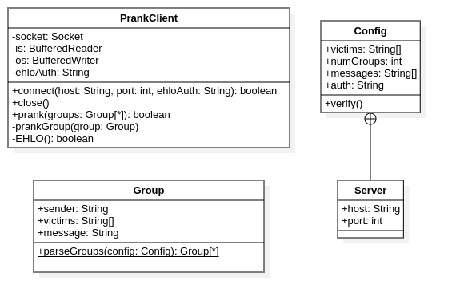
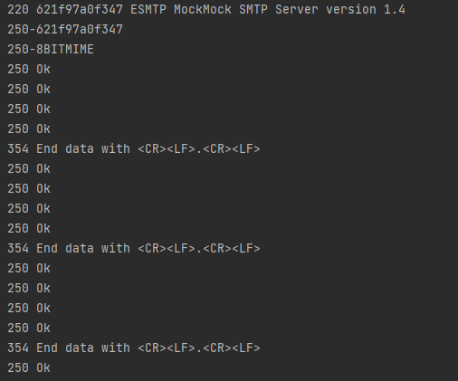

# Prank email with SMTP - API 2021  HEIG - Tobie Praz, Damiano Mondaini

## Description du projet

Remarque importante : Ce projet est à titre éducatif et ne doit pas être utilisé à d'autres fins.
Ce repository GitHub permet d'automatiser l'envoi de mails forgés via un serveur SMTP et une liste de victimes configurables.
Pour chaque exécution du programme une série de mails sera envoyée selon le fichier de configuration `config.json`.

## Mise en place d'un Mock server

Pour simuler l'envoie de mails lors de la phase de tests, il est utile d'utiliser un faux serveur mail SMTP recevant les mails de notre programme. Voici le marche à suivre pour en installer un via Docker:

1. S'assurer que Docker est bien installé sur la machine et est fonctionnel (nous n'entrerons pas dans les détails d'installation de Docker)
2. Construire l'image Docker `Dockerfile` avec la commande `docker build . -t mockserver`
3. Lancer un container Docker avec l'image précédemment construite. Il faut remapper les ports car le Mock server va lancer le server mail sur le port 25 et le serveur web (pour visualiser les mails) sur le port 8282. Voici le commande: `docker run -p 8282:8282 -p 2525:25 mockserver`. Le serveur web est redirigé sur le port 8282 et le serveur mail sur le port 2525.
4. Voilà votre Mock serveur devrait être lancé. N'oubliez pas d'éditer le fichier de configuration !

## Fichier de configuration

Pour gérer la configuration du programme, il faut utiliser le fichier `config.json` à la racine du projet. Le fichier est construit de la manière suivante:
```
{
  "victims": ["sender1@sender.com", "victim1@victim.com", "victim2@victim.com", "sender2@sender.com", "victim3@victim.com", "victim4@victim.com", "sender3@sender.com", "victim5@victim.com", "victim6@victim.com"],
  "numGroups": 3,
  "messages": ["Message 1", "Message 2"],
  "server": {
    "host": "127.0.0.1",
    "port": "2525"
  },
  "auth": "exemple.com"
}
```

* `victims`: Liste des victimes. Les groupes, donc les expéditeurs et les victimes, dépendent de leur ordre de saisie et du nombre de groupes. La première adresse du chaque groupe sera l'expéditeur et les autres les victimes.
* `numGroups`: Définit le nombre de groupes à former à partir de la liste `victims`.
* `messages`: Définit les messages possibles à envoyer lors d'une prank. Le message est assigné au hasard pour chaque groupe.
* `server`: Définit les propriétés du server SMTP auquel se connecter.
  * `server.host`: Adresse IP du serveur SMTP. Note: Si vous utiliser le Mock server fourni, l'adresse IP sera normalement votre adresse loopback `127.0.0.1`.
  * `server.port`: Numéro de port du serveur SMTP. Note: Si vous utiliser le Mock server fourni avec le remappage des ports, le numéro de port  sera normalement `2525`.
* `auth`: Définit l'hôte à utiliser lors de la connection au serveur SMTP

### Notes

* Il n'était pas demandé de pouvoir spécifier un object aux mails. Il est par défaut à `Important`.

## Commandes utiles

* Installer avec Maven: `mvn clean install`
* Lancer l'exécutable: `java -jar target/API-2021-SMTP-1.0-SNAPSHOT-launcher.jar` (/!\ Le fichier de configuration doit se trouver dans le répértoire depuis lequel vous lancer le programme /!\)

## Description de l'implémentation

### Diagramme de classes



### Description des classes

Voici une succincte description des classes et de leurs rôles dans le projet.

#### PrankSMTP.Config et Server

* La classe `PrankSMTP.Config` et sa classe interne `Server` permettent de représenter le fichier de configuration et de manipuler ses informations.
* La méthode `verify()` permet de s'assurer que le fichier de configuration est valide.

#### PrankSMTP.Group

* La classe `PrankSMTP.Group` permet de représenter un groupe qui sera victime d'un prank avec l'expéditeur du message ainsi que les vitctimes et le message.
* La méthode statique `parseGroups(PrankSMTP.Config config)` permet de créer les groupes à partir des informations stockées dans la classe `PrankSMTP.Config`

#### PrankSMTP.PrankClient

* La classe `PrankSMTP.PrankClient` permet de représenter le client SMTP ayant pour mission de se connecter au serveur et envoyer les mails.
* Il dispose de différentes méthodes pour gérer la communication.
* C'est la méthode `prank(PrankSMTP.Group[] groups)` qui permet de commencer tout le processus d'envoi de mails

### Capture d'écran

